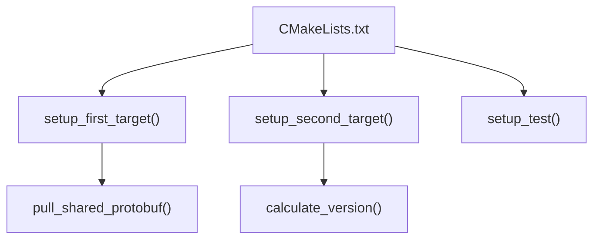

# The Procedural Paradigm in CMake
Let us suppose the we want to write CMake code similar to how we write a program in C++. We'll make a CMakeList.txt listfile that will call three difined commands that may call difined commands of their own.


Functions in CMake must be defined before they are called. 
```cmake
cmake_minimum_required(...)
project(Procedural)

# Definitions
function(pull_shared_protobuf)
function(setup_first_target)
function(calculate_version)
function(setup_second_target)
function(setup_tests)

# Calls
setup_first_target()
setup_second_target()
setup_tests()
```

## A word on naming conventions...
- Follow a consistent naming style(snake_case, etc...)
- Use short but meaningful names.
- Avoid puns and cleverness in your naming.
- Use pronounceable, searchable names. 