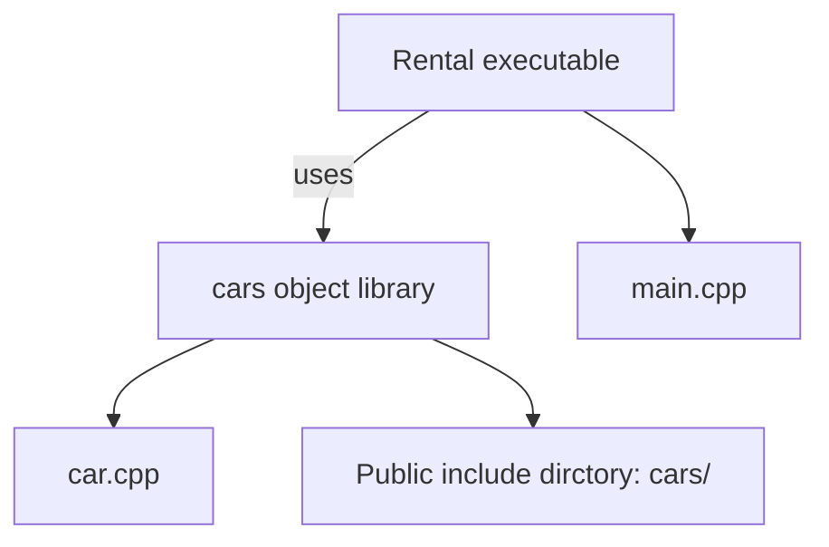

# Managing Scope with Subdirectories... 
It's common practice to structure your project following the natural structure of the filesystem, where nested directories represent the discrete elements of the application, the business logic, GUI, API, and reporting, and finally, separate directories with tests, external dependencies, scripts, and documentation. To support this concept, CMake offers the following command:

```cmake
add_subdirectory(source_dir [binary_dir] [EXCLUDE_FROM_ALL])
```

As already established, this adds a source directory to our build. Optionally, we may provide a path that built files will be written to (binary_dir or the build tree). The EXCLUDE_FROM_ALL keyword will disable the automatic building of targets defined in the subdirectory(we'll cover targets in the next chapter). This may be useful for separating parts of the project that aren't needed for the core functionality(like examples or extensions). 

*add_subdirectory()* will evaluate the source_dir path (relative to the current directory) and parse the CMakeLists.txt file in it. This file is parsed within the directory scope, eliminating the issues mentioned in the previous method:

- Variables are isolated to the nested scope. 
- The nested artifacts can be configured independently. 
Modifying the nested CMakeLists.txt file doesn't require rebuilding unrelated targets. 
- Modifying the nested CMakeLists.txt file doesn't require rebuilding unrelated target. 
- Paths are localized to the directory and can be added to the parent include path if desired. 

This is what the directory structure looks like for our add_subdirectory() example. 
```text
├── CMakeLists.txt
├── cars
│ ├── CMakeLists.txt
│ ├── car.cpp
│ └── car.h
└── main.cpp
```
Here, we have two CMakeLists.txt files. The top-level file will use the nested directory, cars:

**/CMakeLists.txt**
```cmake
cmake_minimum_required(VERSION 3.26.0)
project(Rental CXX)
add_executable(Rental main.cpp)
add_subdirectory(cars)
target_link_libraries(Rental PRIVATE cars)
```
The last line is used to link the artifacts from the cars directory to the Rental executable. It is a target-specific command, which we'll discuss in depth in the next chapter: *Chapter 5, Working with Targets*.

Let's see what the nested listfile looks like:

**cars/CMakeLists.txt**
```cmake
add_library(cars OBJECT
    car.cpp
#   more files in other directoried
)
target_include_directories(cars PUBLIC .)
```
In this example, I have used *add_library()* to produce a globally visible target cars, and added the cars directory to its public **include directories** with *target_link_libraries()*. This informs CMake where the cars.h resides, so when *target_link_libraries()* is used, the main.cpp file can consume the header without providing a relative path:
```C++
#include "car.h"
```


We can see the add_libary() command in the nested listfile, so did we start working with libraries in this example? Actually, no. Since we used the OBJECT keyword, we're indicating we're only interested in producing the **object files**(exactly as we did in the previous example). We just grouped them under a single logical target(cars). You may already have a sense of what a target is. Hold that thought - we'll explain the details in the next chapter. 

