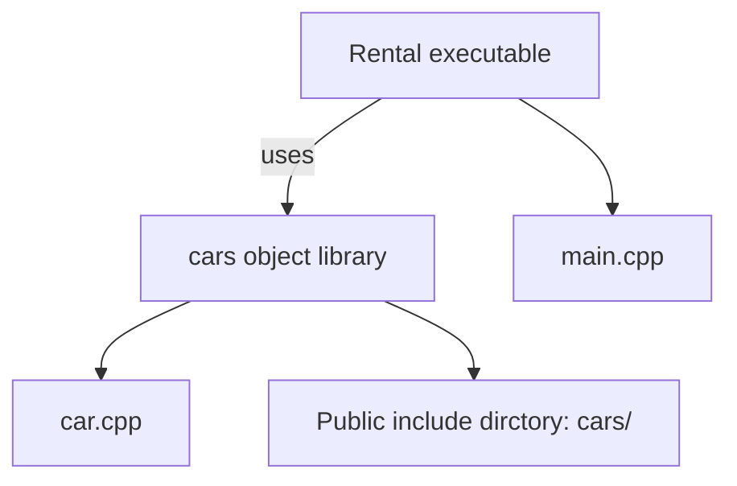

# When to Use Nested Projects... 

In the previous section, we briefly mentioned the EXCLUDE_FROM_ALL argument used in the *add_subdirectory()* command to indicate extraneous elements of our codebase. The CMake documentation suggests that if we have such parts living inside the source tree, they should have their own *project()* commands in their CMakeLists.txt files so that they can generate their own buildsystems and can be built independently. 

Are there any other scenarios where this would be useful? Sure. For example, one scenario would be when you're working with multiple C++ projects built in one CI/CD pipeline(perhaps when building a framework or a set of libraries). Alternatively, maybe you're porting the buildsystem from a legacy solution, such as GNU Make, which uses plain **makefiles**. In such a case, you might want an option to slowly break things down into more independent pieces - possibly to put them in a separate build pipline, or just to work on a smaller scope, which could be loaded by an IDE such as CLion. You can achieve that by sdding the *project()* command to the listfile in the nested directory. Just don't forget to prepend it with *cmake_minimum_required()*. 

Since project nesting is supported, could we somehow connect related projects that are built side by side?

## Keeping external projects external... 
While it is technically possible to reference the internals of one project from another in CMake, it is not a regular or recommended practice. CMake does provide some support for this, including the *load_cache()* command to load values from another project's cache. However, using this approach can result in problems with cyclical dependencies and project coupling. It's best to avoid this command and make a decision: should our related projects be nested, connected through libraries, or merged into a single project? 

These are the partitioning tools at our desposal: *including listfiles, adding subdirectories, and nesting projects*. But how should we use them so our projects stay maintainable and easy to navigate and extend? To do this, we need a well-defined project structure.

