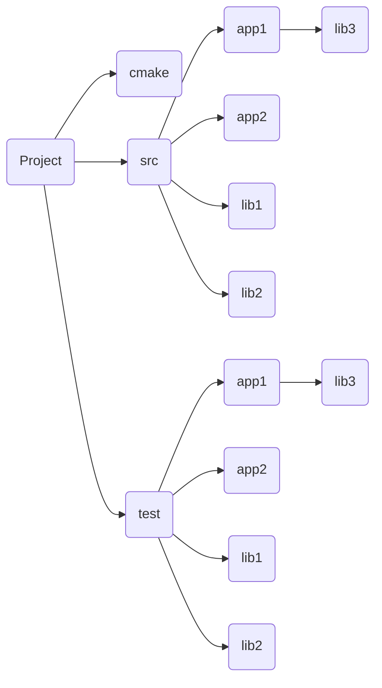
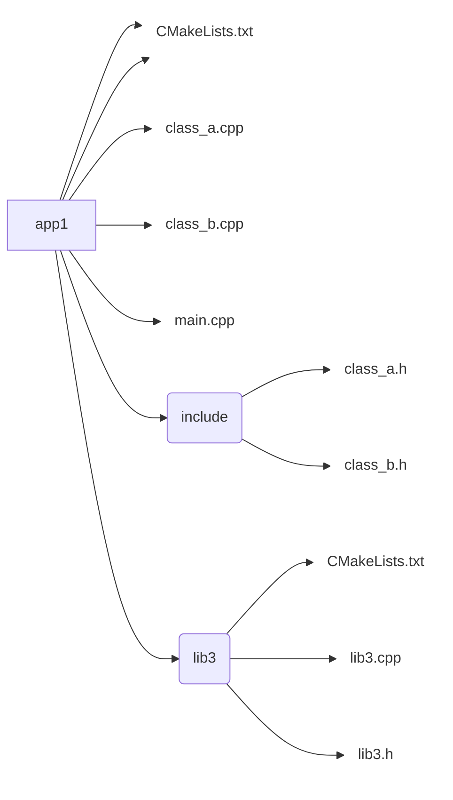
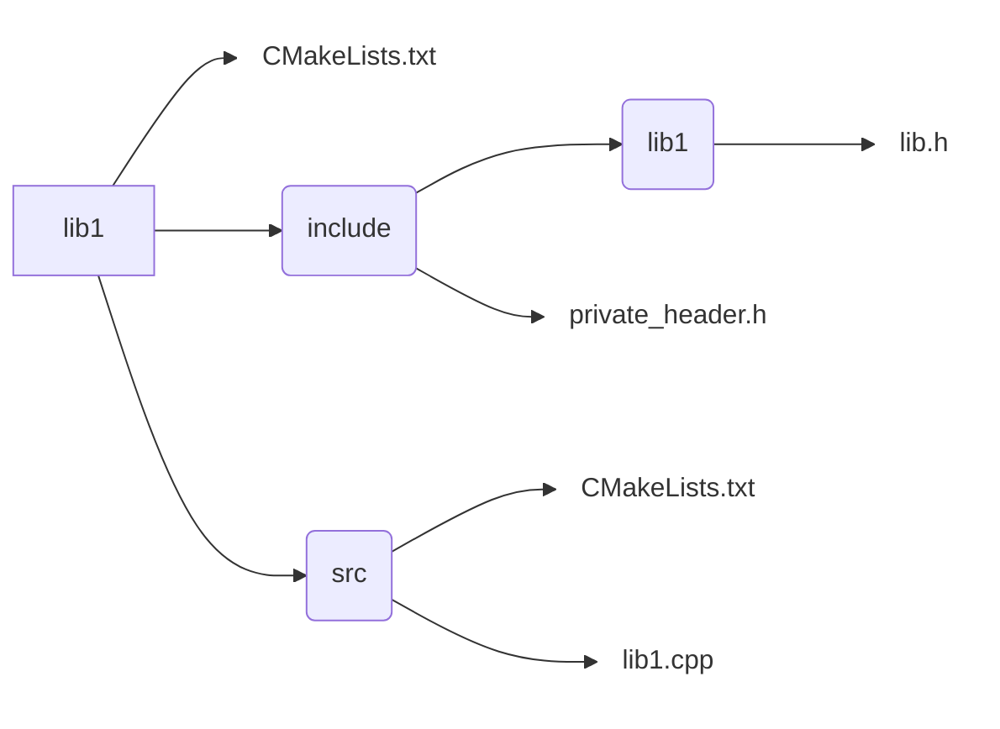
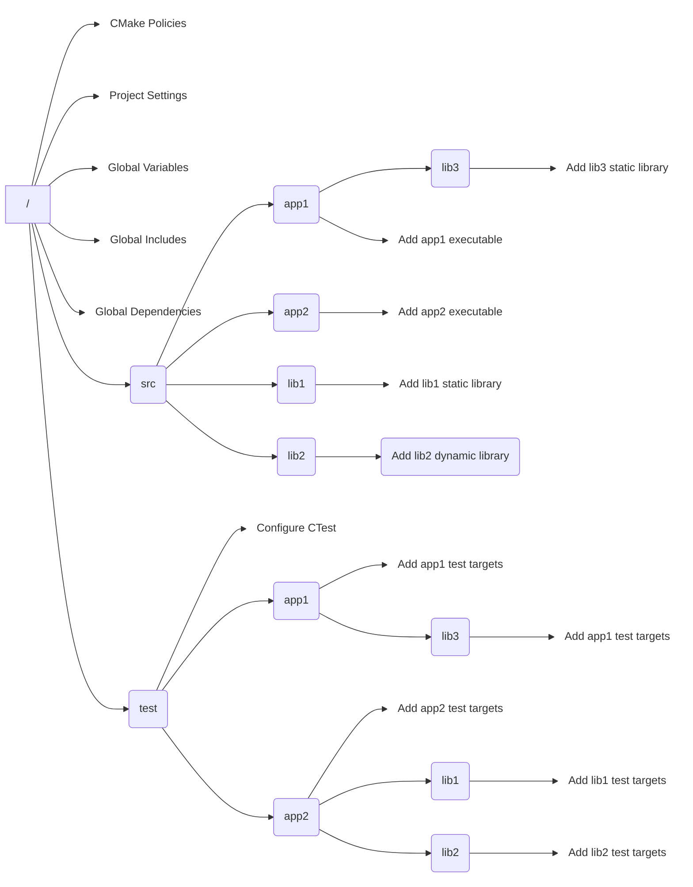

# Thinking About Project Structure...
It's no secret that as a project grows, it becomes harder and harder to find things in it - both in listfiles and in the source code. Therefore, it is very important to maintain the project hygiene right from the start. 

Imagine a scenario where you need to deliver some important, time-sensitive changes, and they don't fit well in either of the two directories in your project. Now, you need to additionally push a *cleanup commit* to restructure the file hierarchy to fit your changes neatly. Or, worse, you decide to just shove them anywhere and add a TODO to deal with the issue later.

Over the course of the year, these problems accumaulate, the technical debt grows, and so does the cost of maintaining the code. This becomes extremely troublesome when there's a crippling bug in a live system that needs a quick fix or when people unfamiliar with the codebase need to introduce occasional changes. 
 
So, we need a good project structure. But what does this mean? There are a few rules that we can borrow from other areas of software development like system design. The project should have the following characteristics:

- Easy to navigate and extend
- Well bounded (project-specific files should be contained to the project directory)
- Individual targets follow the hierarchical tree  
  
https://github.com/PacktPublishing/Modern-CMake-for-Cpp-2E/tree/main/examples/ch04

There isn't one definitive solution, but out of the various project structure templates available online, I suggest using this one as it is simple and extensible:



This project outlines the directories for the following components:

- cmake: Shared macros and functions, find_modules, and one-off scripts
- src: Source and header files for binaries and libraries
- test: Source code for automated tests

In this structure, the CMakeLists.txt file should exist in the following directories: the top-level project directory, test, and src and all its subdirectories. The main listfile shouldn't declare any build steps on its own, but instead, it should configure the general aspects of the project and delegate the responsibility of building to the nested listfiles with the *add_subdirectory()* command. In turn, these listfiles may delegate this work to even deeper layers if needed. 

```text
Important note!

    Some developers suggest separating the executables from the libraries and creating two top-level directories instead of one: src and lib. CMake treats both artifacts
    the same, and separation at this level doesn't really matter. Feel free to follow that model if it's your preference.
```

Having multiple directories in the src directory comes in handy for bigger projects. But if you're building just a single executable or library, you may skip them and store your source files directly in src. In any case, remember to add a CMakeLists.txt file there and exctute any nested listfiles
as well. This is how your file tree might look for a single, simple target:


In the first diagram, we see a CMakeLists.txt file in the root of the src directory - it will configure the key project settings an include all listfiles from nested directories. The app1 directory(visible in the second diagram) contains another CMakeLists.txt file along with the .cpp implementation files: *class_a.cpp* and *class_b.cpp*. There's also the *main.cpp* file with the executable's entry point. The CMakeLists.txt file should define a target that uses these sources to build an executable - again, we'll learn how to do that in the next chapter.  
  
Our header files are placed in the include directory and can be used to declare symbols for other C++ translation units.  
  
Next, we have a lib3 directory, which contains a library specific to this executable only (libraries used elsewhere in the project or exported externally should live in the src directory). This structure offers great flexability and allows for easy project extensions. As we continue adding more classes, we can conveniently group them into libraries to improve compilation speed. Let's see what a library looks like:  


  
Libraries should adhere to the same structure as executables, with a minor distinction: an optional lib1 directory is added to the include directory. This directory is included when the library is intended for external use beyond the project. It contains public header files that other projects will consume during compilation. We'll return to this subject when we start building our own libraries in *Chapter 7, Compiling C++ Sources with CMake*. 
  
So, we have discussed how files are laid out in a directory structure. Now, it's time to take a look at how individual CMakeLists.txt files come together to form a single project and what their rolle is in a bigger scenario.  
  


