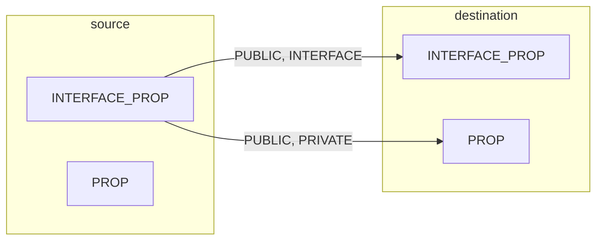

You can find the code files that are present in this chapter on GitHub at https://github.com/PacktPublishing/Modern-CMake-for-Cpp-2E/tree/main/examples/ch05.

# What are Transitive Usage Requirments?
Starting from the middle term **Usage**. One target may depend on another. CMake documentation sometimes refers to such dependency as usage, as in one target *uses* another.  
  
There will be cases when such a *used target* sets specific *properties* or *dependencies* for itself, which, in turn, constitute **requirments** for other targets that use it: ling some libraries, include a directory, or require specific compiler features.  
  
The last part of our puzzle, **transitive**, describes the behavior correctly. CMake appends some properties/requirments of *used targets* to properties of *using targets*. You can say that some properties can transition(or simply propagate) accross targets implicitly, so it's easier to express dependencies.  
  
Simplifying this whole concept, I see it as **propagated properties** between the **source target**(targets that get used) and **destination targets**(targets that use other targets).  
  
Let's look at a concrete example to understand why it's there and how it works:
```cmake
target_compile_definitions(<source> <INTERFACE|PUBLIC|PRIVATE> [items1...])
```
This target command will populate the COMPILE_DEFINITIONS property of a \<source\> target. **Compile definitions** are simply -Dname=difinitiion flags passed to the compiler that configure the C++ preprocessor definitions. The interesting part here is the second argument. We need to specify one of the three values, INTERFACE, PUBLIC, or PRIVATE, to control which targets the property should be passed to.  
  
- **PRIVATE** sets the property of the source target. 
- **INTERFACE** sets the property of the destination targets. 
- **PUBLIC** sets the property of the source destination targets.  
  
When a property is not to be transitioned to any destination targets, set it to PRIVATE. When such a transition is needed, go with PUBLIC. If you're in a situation where the source target doesn't use the property in its implementation(.cpp files) and only in the headers, and these are passed to the consumer targets, INTERFACE is the keyword to use.  
  
How does this work under the hood? To manage those properties, CMake provides a few commands a the aforementioned **target_compile_definitions()**. When you specify a PRIVATE or PUBLIC keyword, CMake will store provided values in the property of the target, in this case, COMPILE_DEFINITIONS. Additionally, if a keyword is INTERFACE or PUBLIC, it will store the value in a property with and INTERFACE_prefix - INTERFACE_COMPILE_DEFINITIONS. During the configuration stage, CMake will read the interface properties of source targets and append their contents to destination targets. There you have it - propagated properties, or Transitive Usage Requirments, as CMake calls them.  
  
Properties managed with the **set_target_properties()** command can be found at:  
https://cmake.org/cmake/help/latest/manual/cmake-properties.7.html  
in the *Properties on Targets section*(not all target properties are transitive). Here are the most important ones:  
  
- COMPILE_DEFINITIONS
- COMPILE_FEATURES
- COMPILE_OPTIONS
- INCLUDE_DIRECTORIES
- LINK_DEPENDS
- LINK_DIRECTORIES
- LINK_LIBRARIES
- LINK_OPTIONS
- POSITION_INDEPENDENT_CODE
- PRECOMPILE_HEADERS
- SOURCES  
  
We'll discuss most of these options in the following pages, but remember that all of these options are, of course, described in the CMake manual. Find them described in detail at the following link. (replace\<PROPERTY\> with a property that interests you):  
https://cmake.org/cmake/help/latest/prop_tgt/<PROPERTY>.html  
  
The next question that comes to mind is how far this propagation goes. Are the properties set just on the first destination target, or are they sent to the very top of the dependency graph? You get to decide.  
  
To create a dependency between targets, we use the target_link_libraries() command. The full signature of this command requires a propagation keyword:
```cmake
target_link_libraries(<target> <PRIVATE|PUBLIC|INTERFACE> <item>... [<PRIVATE|PUBLIC|INTERFACE> <item>...]...)
```  
  
As you can see, this signature also specifies a propagation keyword, and it controls how properties from the *source target* get stored in the *destination target*. The figure below shows what happens to a propagated property during the generation stage(after the configuration is complete):  
  

  
Propagation keywords work like this:
- PRIVATE appends the source value to the private property of the source target. 
- INTERFACE appends the source value to the interface property of the source target. 
- PUBLIC appends to both properties of the source target.  
  
As we decussed before, interface properties are only used to propagate the properties further down the chain(to the next destination target), and the source target won't use them in its build process.  
  
The basic target_link_libraries(\<target\> \<item\>...) command that we used before implicitly specifies the PUBLIC keyword.  
  
If you correctly set propagation keyword for your source targets, properties will be automatically placed on destination targets for you - unless there's a conflict. 